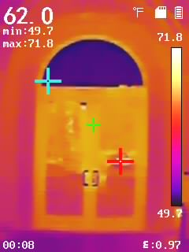
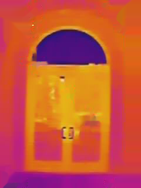

# Thermal Image Cleaning & Crosshair Detection

**Authors**: Zachary Culp & Samantha Fleming

An automated pipeline for detecting crosshair markers (red, cyan, and green) and cleaning thermal images by removing UI elements, scales, text, and visual artifacts using masking and Navier-Stokes inpainting.

## Table of Contents

[Features](#features)

[Project Structure](#proj_str)

[Installation](#installation)

[Usage](#usage)

[Technical Details](#tech_details)

[Configuration Parameters](#config_pars)

[Visualization Output](#vis_out)

[Supported Image Formats](#img_fmt)

[Example Output](#ex_out)

[Troubleshooting](#troubleshooting)

[Performance Notes](#perf_notes)

[Contributing](#contributing)

[Citation](#citation)

[Acknowledgments](#acks)

[Contact](#contact)

| Before | After |
|--------|-------|
|  |  |


## Features

<a name="features"></a>

- **Automatic Crosshair Detection**
  - Red crosshair detection with intelligent single-point selection
  - Cyan crosshair detection and filtering
  - Green crosshair detection (multiple points supported)
  - Automatic exclusion of crosshairs in temperature scale regions
  
- **Intelligent Image Cleaning**
  - Multi-method artifact detection (BGR + HSV color thresholding)
  - Edge detection with Canny algorithm
  - Morphological filtering and connected component analysis
  - Location-based masking for UI elements
  - Relative brightness detection for text overlays
  - Custom region masking for temperature scale removal
  - Navier-Stokes image inpainting for seamless reconstruction

- **Batch Processing**
  - Process entire folders of thermal images automatically
  - Supports multiple image formats (JPG, PNG, BMP, TIFF)
  
- **Comprehensive Outputs**
  - Cleaned thermal images (PNG format)
  - CSV files with detected crosshair coordinates
  - Optional analysis visualizations showing detection process

## Project Structure

<a name="proj_str"></a>

```
project-folder/
│
├── Cuneo_Hall/                 # Input images (your raw thermal images)
│   ├── image1.png
│   ├── image2.png
│   └── ...
│
├── Cuneo_Hall_cleaned/         # Output folder (auto-created)
│   ├── image1_cleaned.png
│   ├── image1_coordinates.csv
│   ├── image1_analysis.png     # (if VISUALIZE=True)
│   └── ...
│
├── thermal_cleaning.py         # Main Python script
└── README.md                   # This file
```

## Installation

<a name="installation"></a>

### Prerequisites

- Python 3.7 or higher
- pip package manager

### Install Required Packages

Install all dependencies with a single command:

```bash
pip install opencv-python numpy matplotlib pandas
```

Or create a `requirements.txt` file:

```txt
opencv-python>=4.5.0
numpy>=1.19.0
matplotlib>=3.3.0
pandas>=1.1.0
```

Then install:

```bash
pip install -r requirements.txt
```

## Usage

<a name="usage"></a>

### Quick Start

1. **Place your images** in an input folder (e.g., `Cuneo_Hall/`)

2. **Configure the script** by editing these lines at the top of `thermal_cleaning.py`:

```python
# ================================================================
# USER INPUT (EDIT ONLY THIS SECTION)
# ================================================================

INPUT_FOLDER = "Cuneo_Hall"           # Your input folder name
OUTPUT_FOLDER = "Cuneo_Hall_cleaned"  # Your output folder name
VISUALIZE = True                       # Set to False to skip visualizations
```

3. **Run the script**:

```bash
python thermal_cleaning.py
```

### Output Files

For each processed image, the script generates up to 3 files:

| File | Description |
|------|-------------|
| `{name}_cleaned.png` | Cleaned thermal image with all artifacts removed |
| `{name}_coordinates.csv` | Detected crosshair coordinates in CSV format |
| `{name}_analysis.png` | 6-panel visualization showing detection process (optional) |

### CSV Output Format

The coordinate CSV file contains detected crosshair positions:

```csv
Color,X,Y
Red,245,189
Cyan,512,384
Green,128,256
Green,156,312
```

- **Color**: Crosshair type (Red, Cyan, or Green)
- **X, Y**: Pixel coordinates in the original image

## Technical Details

<a name="tech_details"></a>

### Detection Algorithm

1. **Color Space Conversion**: Images are analyzed in both BGR and HSV color spaces
2. **Crosshair Detection**:
   - **Red**: Uses dual HSV range (0-6° and 174-180°) to capture red hue wrap-around
   - **Cyan**: HSV range [80-100° hue, 100-255 saturation, 150-255 value]
   - **Green**: HSV range [35-75° hue, 100-255 saturation, 120-255 value]
3. **Filtering**: Contours filtered by area (8-500 pixels) with aspect ratio validation
4. **Smart Selection**: Red crosshairs use largest contour centroid for accurate single-point selection
5. **Scale Exclusion**: Automatically excludes crosshairs in temperature scale region (rightmost 10% of image)

### Mask Creation Process

The cleaning mask is built from multiple detection layers:

1. **White/Gray Text**: BGR and HSV thresholding for text overlays
2. **Yellowish UI**: HSV detection of temperature/date text
3. **Crosshairs**: Dedicated plus-sign detection with size/aspect filtering
4. **Edge Detection**: Canny edges near text regions (dilated mask intersection)
5. **Relative Brightness**: Local mean subtraction to find bright overlays
6. **Location-Based**: 
   - Temperature scale (rightmost 10% of image)
   - Corner regions with UI elements
   - Custom region (X: 198→end, Y: 262→675) for minimum temperature text
7. **Morphological Cleanup**: Closing (2 iterations) and opening (1 iteration)
8. **Connected Components**: Filter by area (5-8000 pixels) and aspect ratio (<15)

### Inpainting

Uses OpenCV's Navier-Stokes inpainting (`cv2.INPAINT_NS`) with 3-pixel radius for smooth, natural reconstruction of masked regions.

## Configuration Parameters

<a name="config_pars"></a>

Advanced users can modify these parameters in `process_single_image()`:

```python
# Location thresholds
SCALE_START_PERCENT = 0.90          # Temperature scale starts at 90% width
CORNER_MARGIN_X_PERCENT = 0.2       # Horizontal corner margin
CORNER_MARGIN_Y_PERCENT = 0.12      # Vertical corner margin

# Color detection thresholds (HSV)
HSV_LOWER_WHITE = np.array([0, 0, 200])
HSV_UPPER_WHITE = np.array([180, 40, 255])

# Morphological operations
MORPH_KERNEL = np.ones((3, 3), np.uint8)
CLOSE_ITERS = 2                     # Closing iterations
OPEN_ITERS = 1                      # Opening iterations

# Component filtering
MIN_AREA_THRESH = 5                 # Minimum artifact area (pixels)
MAX_AREA_THRESH = 8000              # Maximum artifact area (pixels)
INPAINT_RADIUS = 3                  # Inpainting radius (pixels)
```

## Visualization Output

<a name="vis_out"></a>

When `VISUALIZE=True`, each image generates a 6-panel analysis figure:

| Panel | Content |
|-------|---------|
| **Top-Left** | Original image with detected crosshairs marked |
| **Top-Middle** | Combined raw mask before cleanup |
| **Top-Right** | Final cleaned mask after filtering |
| **Bottom-Left** | Crosshair detection mask |
| **Bottom-Middle** | Location-based UI removal mask |
| **Bottom-Right** | Final cleaned result |

## Supported Image Formats

<a name="img_fmt"></a>

- JPEG (`.jpg`, `.jpeg`)
- PNG (`.png`)
- Bitmap (`.bmp`)
- TIFF (`.tiff`, `.tif`)

## Example Output

<a name="ex_out"></a>

### Before Processing
Raw thermal image containing:
- Temperature scale and numeric values
- Crosshair markers (red, cyan, green)
- UI text overlays (time, date, settings)
- Corner information boxes

### After Processing
- Clean thermal data only
- All UI elements removed
- Smooth inpainted regions
- Crosshair coordinates preserved in CSV

## Troubleshooting

<a name="troubleshooting"></a>

### No crosshairs detected

**Possible causes:**
- Crosshair colors don't match expected HSV ranges
- Crosshairs too small or large (outside 8-500 pixel area range)
- Crosshairs located in temperature scale region (automatically excluded)

**Solutions:**
- Check HSV color ranges in `detect_plus_sign_coordinates()`
- Adjust `min_area` and `max_area` parameters in `extract_points()`
- Verify `SCALE_START_PERCENT` if crosshairs appear in scale region

### Poor inpainting results

**Possible causes:**
- Mask too aggressive or missing artifacts
- Inpainting radius too small for large gaps

**Solutions:**
- Review visualization output (`_analysis.png`) to inspect masks
- Increase `INPAINT_RADIUS` parameter (try 5-10)
- Adjust morphological operation iterations
- Modify color threshold ranges

### Images not processing

**Possible causes:**
- Unsupported file format
- Corrupted image files
- Permission issues

**Solutions:**
- Verify image format is supported (see list above)
- Check console output for specific error messages
- Ensure read/write permissions for input/output folders

### Import/Module errors

```bash
# Reinstall all dependencies
pip install --upgrade opencv-python numpy matplotlib pandas

# Verify installations
python -c "import cv2, numpy, matplotlib, pandas; print('All modules OK')"
```

## Performance Notes

<a name="perf_notes"></a>

- Processing time: ~2-5 seconds per image (depends on resolution)
- Memory usage: Scales with image resolution
- Batch processing: Progress displayed in console with `[n/total]` counter

## Contributing

<a name="contributing"></a>

Contributions are welcome! Areas for enhancement:
- Additional crosshair color detection
- Machine learning-based artifact detection
- Adaptive threshold tuning
- Support for video files

## Citation

<a name="citation"></a>

```
STAT-495 Consulting Project - Thermal Image Analysis
Loyola University Chicago, 2025
```


## Acknowledgments

<a name="acks"></a>

- **OpenCV** for comprehensive image processing capabilities
- **Navier-Stokes inpainting** algorithm for artifact removal
- **Marquette University** STAT-495 Consulting course

## Contact

<a name="contact"></a>

For questions, issues, or feature requests:
- Open an issue on GitHub
- Contact the project team via course instructor

---

**Course:** STAT-495 Statistical Consulting  
**Institution:** Loyola University Chicago
**Application:** Thermal Image Analysis and Processing
